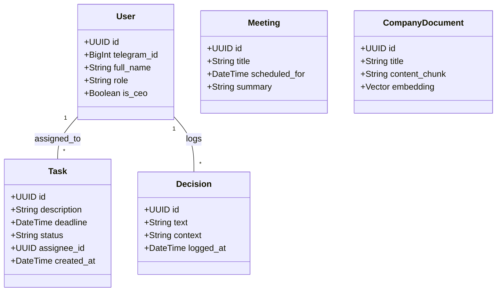
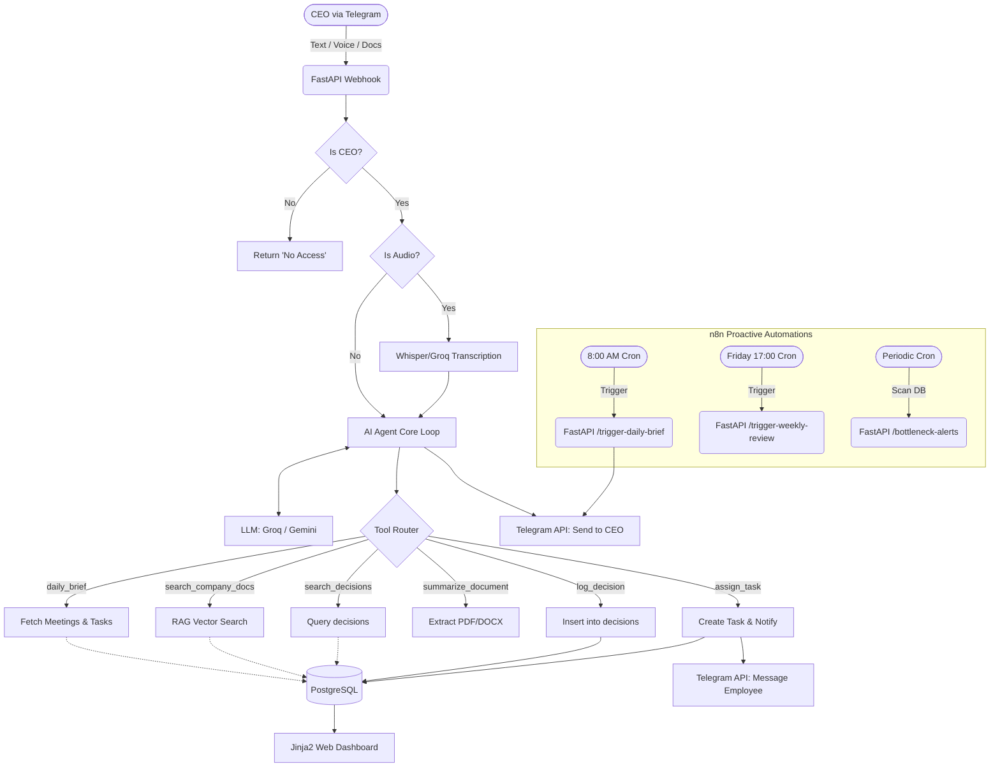

# 👔 CEO Chief of Staff AI Agent (`@company_ceo_agent_bot`)

## 📖 Project Overview
This project implements a highly confidential, proactive AI assistant designed exclusively for the company CEO[cite: 1]. Rather than a simple reactive chatbot, this agent acts as a digital Chief of Staff. It manages task delegation, tracks long-term strategic decisions, synthesizes documents, and orchestrates daily operations[cite: 1].

Built with strict security guardrails, the bot responds only to the designated CEO (`ALLOWED_USERS=1`) and handles external integrations to automate executive workflows[cite: 1].

---

## 🛠 Tech Stack
*   **Backend Interface:** FastAPI (handles webhooks, API routes, and agent loop)
*   **Telegram Integration:** `aiogram 3` (async, webhook-based)
*   **Database & ORM:** PostgreSQL + SQLModel (Pydantic-compatible ORM) + Alembic for migrations
*   **AI Engine:** OpenRouter OpenAI/Anthropic/Gemini API (fallback & embeddings)[cite: 1]
*   **Automation & Cron:** n8n (handles proactive scheduled triggers like 8:00 AM briefs)
*   **Frontend Dashboard:** Jinja2 + HTML/TailwindCSS (Telegram Web App embedded UI)
*   **Deployment:** Docker & Docker Compose on Ubuntu Linux[cite: 1]

---

## 🗄️ Database Architecture & SQLModel Schemas (Core)

The system relies on a relational PostgreSQL database to maintain state, memory, and relationships. Below is the UML Class Diagram defining the entity relationships, followed by the technical SQLModel definitions.

### Entity Relationship Diagram


### SQLModel Definitions

We utilize `SQLModel` to bridge FastAPI's Pydantic validation with SQLAlchemy's database interactions.

**1. Users Table (Security & Auth)**
Controls access. Only the CEO can interact with the bot. Other users exist here strictly as `Task` assignees.

```python
class User(SQLModel, table=True):
    id: uuid.UUID = Field(default_factory=uuid.uuid4, primary_key=True)
    telegram_id: int = Field(unique=True, index=True)
    full_name: str
    role: str
    is_ceo: bool = Field(default=False)

```

**2. Tasks Table (`assign_task` Tool)**
Tracks delegations. When the agent calls `assign_task`, it writes to this table and triggers a notification if the `assignee_id` has a registered `telegram_id`.

```python
class Task(SQLModel, table=True):
    id: uuid.UUID = Field(default_factory=uuid.uuid4, primary_key=True)
    description: str
    deadline: datetime
    status: str = Field(default="pending") # pending, in_progress, completed
    assignee_id: uuid.UUID = Field(foreign_key="user.id")
    created_at: datetime = Field(default_factory=datetime.utcnow)

```

**3. Decisions Table (`log_decision` & `search_decisions` Tools)**
The strategic memory of the CEO. Logs why and when choices are made.

```python
class Decision(SQLModel, table=True):
    id: uuid.UUID = Field(default_factory=uuid.uuid4, primary_key=True)
    text: str
    context: str
    logged_at: datetime = Field(default_factory=datetime.utcnow)
    logger_id: uuid.UUID = Field(foreign_key="user.id") # Usually the CEO

```

**4. Meetings Table (`daily_brief` Tool)**
Queried by the daily brief automation to prep the CEO for the day.

```python
class Meeting(SQLModel, table=True):
    id: uuid.UUID = Field(default_factory=uuid.uuid4, primary_key=True)
    title: str
    scheduled_for: datetime
    summary: Optional[str] = None

```

---

## ⚙️ System Flow & Automation

To achieve a "Professional Tier" setup, n8n manages proactive alerts rather than relying solely on user input.

### Automation Flowchart



---

## 🛠️ AI Agent Tools (Function Calling)

The agent uses the following schema-defined tools:

1. **`daily_brief()`**: Aggregates today's meetings and overdue tasks from the database.


2. **`log_decision(text, context)`**: Writes directly to the `Decision` SQLModel table.


3. **`search_decisions(query)`**: Performs semantic/keyword search on past decisions.


4. **`assign_task(person, text, deadline)`**: Inserts into the `Task` table and pings the employee via Telegram.


5. **`summarize_document(file)`**: Extracts text from uploads and returns a 5-point markdown summary.


6. **`search_company_docs(query)`**: RAG pipeline against OKR/Strategy documents using Gemini text-embeddings.


---

## 🚀 Deployment & Local Setup

The agent is containerized for seamless deployment on the company's Ubuntu VPS.

**1. Clone & Configure Environment**

```bash
git clone https://github.com/b12hub/Ceo-AI-Ahent.git
cd ceo-ai-agent
cp .env.example .env

```

*Ensure `.env` contains `BOT_TOKEN`, `GROQ_API_KEY`, `GEMINI_API_KEY`, and `ALLOWED_USERS` list.*

**2. Launch with Docker Compose**

```bash
docker compose up -d --build

```

**3. Check Container Logs**

```bash
docker compose logs -f bot

```

**4. Run Evaluations**
An automated testing script is included to verify the agent's behavior and hallucination guardrails.

```bash
docker compose exec bot python -m eval.run

```

---

## 🧠 Design Decisions & Limitations

* **Why n8n for Cron?** Native Python `asyncio` schedules or APScheduler can lose state on container restarts. n8n provides a visual, decoupled cron mechanism that safely triggers FastAPI endpoints.
* **Why SQLModel?** It prevents code duplication by using the same classes for FastAPI Pydantic validation and SQLAlchemy table definitions.
* **What is NOT included:** Complex multi-agent routing (LangGraph). Given the tight timeline, a strict single-agent loop with retry-backoff mechanisms was prioritized for stability.